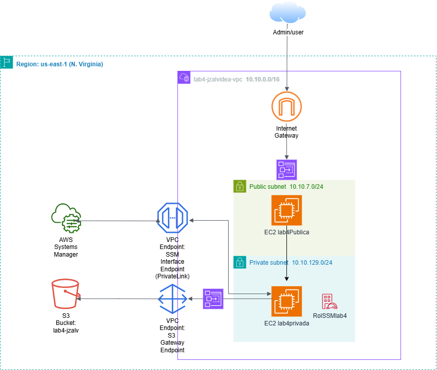
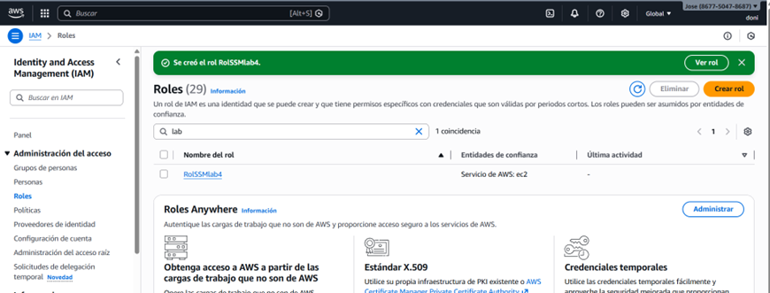
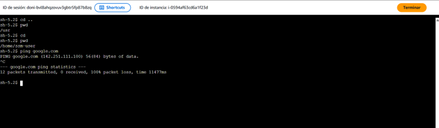
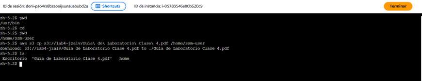

# 🌐 AWS Networking: Arquitectura Zero-Trust y Conectividad Privada

Este proyecto documenta la implementación de una red empresarial en AWS diseñada bajo el principio de **aislamiento total**, utilizando VPC Endpoints para eliminar la exposición a la internet pública.

## 🏗️ Resumen de la Arquitectura
La infraestructura se despliega en la región **us-east-1** y se compone de una VPC con segmentación de subredes públicas y privadas. El corazón del proyecto es la comunicación interna hacia servicios como **S3** y **SSM** sin utilizar un NAT Gateway o Internet Gateway para el tráfico privado.

## 🛠️ Hitos Técnicos

### 1. Gestión de Identidad y Roles (IAM)
Se configuró un rol de servicio (`RolSSMlab4`) para permitir que las instancias EC2 utilicen el agente de Systems Manager de forma nativa. 
> **Evidencia**: Se asoció el rol a instancias en ejecución sin interrupción de servicio.

### 2. Endpoints de Interfaz y Gateway
Para garantizar que la instancia privada no sea rastreable desde internet, se implementaron:
*   **VPC Interface Endpoints**: Para la gestión vía SSM.
*   **VPC Gateway Endpoint**: Para la persistencia de objetos en Amazon S3.

## 🧪 Validación de Seguridad
El éxito de la arquitectura se validó mediante dos pruebas críticas:
1.  **Aislamiento**: La instancia privada no tiene salida a internet (Ping a Google fallido).
2.  **Conectividad Interna**: La misma instancia privada logró cargar exitosamente reportes hacia el bucket `lab4-jzalv` utilizando la ruta privada de AWS.

---
### 🔗 Proyectos Relacionados
*   [Auditoría de Red - VPC Flow Logs](https://github.com/tu-usuario/VPC-Flow-Logs): Monitoreo de tráfico sobre esta infraestructura.
*   [Industrial SOC - Wazuh](https://github.com/tu-usuario/Wazuh-SOC): Centro de monitoreo para estos activos.
